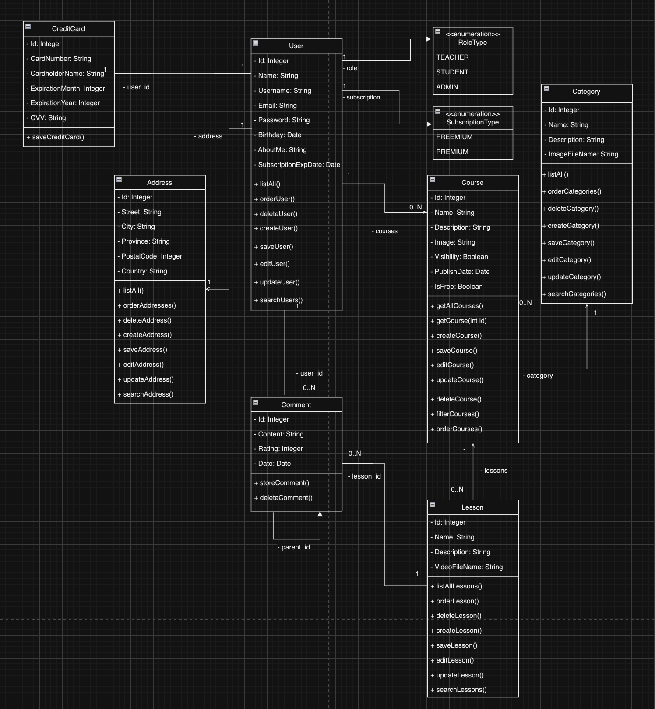

# Especificación inicial
Moktys es una plataforma de educación en línea.
## Objetivos
Con Moktys lo que queremos lograr es una plataforma de educación de habla hispana para adquirir conocimientos en diferentes áreas, como informática, estilo de vida, diseño, fotografía, marketing, disciplinas académicas…

En la plataforma va a haber posibilidad de publicar cursos grabados y ofrecer clases individuales como profesor; el alumnado va a poder consumir estos cursos y valorar la calidad de estos cursos. El objetivo es crear una comunidad de aprendizaje y superación ajustada a las necesidades de cada uno.
## Descripción
### Aplicación de gestión (intranet)
La aplicación de gestión interna está dividida en dos roles: administrador y profesor. Ambos acceden mediante un usuario y contraseña.

Los administradores realizarán las siguientes gestiones:

-   Gestión de los cursos publicados: son los encargados de aprobar los cursos subidos por los profesores. Por lo tanto, los usuarios no podrán acceder a estos hasta que tengan el visto bueno.
    
-   Gestión del público: puesto que los cursos admiten comentarios de otros usuarios, tienen el poder de eliminar comentarios si no cumplen con la política de conducta.
    
-   Gestión de los usuarios: controlan todo lo relacionado a la creación, modificación y suspensión de usuarios.
    

Los profesores se encargarán de lo siguiente:

-   Publicar cursos: una vez haya creado un curso y hayan realizado una grabación de las clases, se encargarán de publicarlo en la plataforma. Este curso no estará disponible hasta que el administrador haya confirmado la calidad y relevancia del curso.
    
-   Responder a comentarios: sean dudas o críticas, podrán ponerse en contacto con los usuarios que visualizan su contenido haciendo uso del foro.
    
-   Impartir clases individuales a usuarios que requieran su atención primaria.
    

Todas las operaciones se realizan mediante una interfaz web que permite realizar las operaciones de altas, bajas, modificaciones y consultas. La gestión de los cursos publicados la realizará un administrador con un tiempo límite de una semana tras la que el profesor haya publicado su curso.

### Acceso a cursos y a clases educativas (web pública)

La web pública va dirigida especialmente a los usuarios con el rol de “alumno”. Podrán realizar lo siguiente:

-   Suscribirse a la página web con un método de pago que permita la visualización de todos los cursos sin limitaciones.
    
-   En caso de no estar suscritos, los alumnos solo podrán visualizar dos vídeos de cada curso publicado como método de prueba.
    
-   Comentarán sus preguntas y críticas de los vídeos en un foro donde podrán ser contestados por profesores o por ellos mismos.
    
-   Podrán valorar los cursos con un método de valoración con estrellas.
    
-   Serán capaces de visualizar los perfiles de los profesores.
    

## Público objetivo

El público objetivo de Moktys son personas interesadas en adquirir conocimientos y habilidades en diferentes ámbitos, tanto académicos como de estilo de vida. Esto incluye desde principiantes hasta profesionales que buscan mejorar sus conocimientos o aprender nuevas habilidades.

# MOKTYS - Entrega 1
## Diagrama de clases

# MOKTYS - Entrega 3
## Tabla de participación
| Luna Samanta Willems | Carolina Fernández | Pablo Lecocq Hernandis | Georg Usin | Guillermo González Richart |
| -------------------- | ------------------ | ---------------------- | ---------- | -------------------------- |
| 22 % | 22 % | 22 % | 22 % | 12 % |