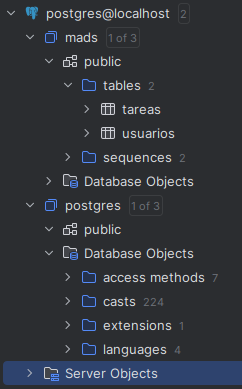

# Práctica 3

## Pantalla de la base de datos PostgreSQL




## Clases y Métodos

### Equipo
- Se han añadido las funciones `addUsuario` y `deleteUsuario` para agregar y eliminar usuarios de los equipos.

### EquipoServices
- Se han implementado los servicios `anyadirUsuario` y `eliminarUsuario` para agregar y eliminar usuarios de los equipos, utilizando los métodos de la clase `Equipo` antes mencionados.
- **`editarEquipo`**: Servicio para modificar el nombre de un equipo.
- **`eliminarEquipo`**: Servicio para eliminar un equipo.

### EquipoController
- Se han implementado las funciones necesarias para poder crear un nuevo equipo, editarlo, eliminarlo, apuntarse y salir de un equipo.
  - **`formNuevoEquipo`**: Función que devuelve el formulario `formNuevoEquipo`.
  - **`nuevoEquipo`**: Función que procesa los datos ingresados en el formulario `formNuevoEquipo`, crea un nuevo equipo con ellos y redirige a `/equipos`.
  - **`formEditaEquipo`**: Función que devuelve el formulario `formEditarEquipo`.
  - **`grabaEquipoEditado`**: Función (POST) que procesa los datos ingresados en el formulario `formEditaEquipo`, modifica el nombre del equipo y redirige a `/equipos`.
  - **`anyadirUsuario`**: Función para agregar un usuario a un equipo.
  - **`eliminarUsuario`**: Función para eliminar a un usuario de un equipo.
  - **`borrarEquipo`**: Función para eliminar un equipo.

## Plantillas Thymeleaf

- **`listaEquipo`**: Se han añadido los botones de **Entrar**, **Salir**, **Editar** y **Eliminar**. Estos dos últimos solo serán visibles para el usuario Administrador.
- **`formNuevoEquipo`**: Formulario para ingresar el nombre y crear un nuevo equipo.
- **`formEditarEquipo`**: Formulario para editar el nombre de un equipo.
- **Fragments**: Se ha añadido en la barra de navegación (navbar) la sección **Equipos**, solo disponible para los usuarios autenticados.

## Tests

### EquipoServiceTest
- **`añaditUsuarioAEquipo_Success`**: Test que comprueba que se agrega exitosamente un usuario a un equipo.
- **`eliminarUsuarioDeEquipo_Success`**: Test que comprueba que se elimina exitosamente un usuario de un equipo.
- **`editarEquipo`**: Test para verificar que el servicio `editarEquipo` funciona correctamente.
- **`testEliminarEquipo`**: Test para verificar que un equipo se elimina correctamente mediante el uso del servicio `eliminarEquipo`.

### NavbarWebTest
- **`getHomeDevuelveEquiposSiUsuarioRegistrado`**: Test que comprueba si se muestra correctamente la opción **Equipos** al haber un usuario autenticado.

### EquipoWebTest
- **`getNuevoEquipoDevuelveForm`**: Test que comprueba que la petición `/equipos/nuevo` devuelve correctamente el formulario para crear un nuevo equipo.
- **`postNuevoEquipoDevuelveRedirectYAñadeEquipo`**: Test que comprueba que después del envío del formulario, se redirige al usuario a la petición `/equipos` y aparece el nuevo equipo en esa lista.
- **`testEntrarUsuarioEnEquipo`**: Test que verifica que un usuario, tras unirse a un equipo, es redirigido a `/equipos`.
- **`testSalitUsuarioDeEquipo`**: Test que verifica que un usuario, tras salir de un equipo, es redirigido a `/equipos`.
- **`testFormEditaEquipo`**: Test que comprueba que la petición `/equipos/{id}/editar` devuelve correctamente el formulario para editar el equipo. Solo podrá modificar el nombre.
- **`deleteTareaDevuelveOKyBorraTarea`**: Test que comprueba que al eliminar un equipo, este no aparece más en el listado de equipos.

## Fragmento de Código Interesante

```java
@Transactional
public EquipoData editarEquipo(Long idEquipo, String nuevoNombre) {
    Equipo equipo = equipoRepository.findById(idEquipo).orElse(null);
    if (equipo == null) {
        throw new EquipoServiceException();
    }
    equipo.setNombre(nuevoNombre);
    equipo = equipoRepository.save(equipo);
    return modelMapper.map(equipo, EquipoData.class);
} ```

Repasemos el servicio `editarEquipo`:
- Realiza una búsqueda en el repositorio de equipos para encontrar uno con el mismo identificador que el pasado como parámetro. Si no lo encuentra, lanza la excepción `EquipoServiceException`, informando que no se ha encontrado el equipo.
- Modifica el nombre del equipo utilizando la función `setNombre` implementada en la clase `Equipo`.
- Guarda la modificación realizada en el repositorio.
- Finalmente, devuelve un DTO del equipo modificado al modelo.

### Consideraciones de Seguridad

Lo interesante es que esta función está diseñada para uso exclusivo del usuario Administrador, pero **no estamos realizando ninguna comprobación para verificar si el usuario autenticado es administrador**. 

Actualmente, evitamos que los usuarios no administradores accedan a estas opciones escondiendo los botones correspondientes en la vista del listado de equipos. Así, si no saben que esas opciones existen, evitamos que las puedan utilizar.

Sin embargo, la desventaja de este enfoque es que, si los usuarios no administradores ingresan las peticiones correspondientes (por ejemplo, editando la URL), podrían:
1. Modificar el nombre del equipo.
2. En el peor de los casos, eliminarlo completamente.

Esto representa un gran riesgo de seguridad.


